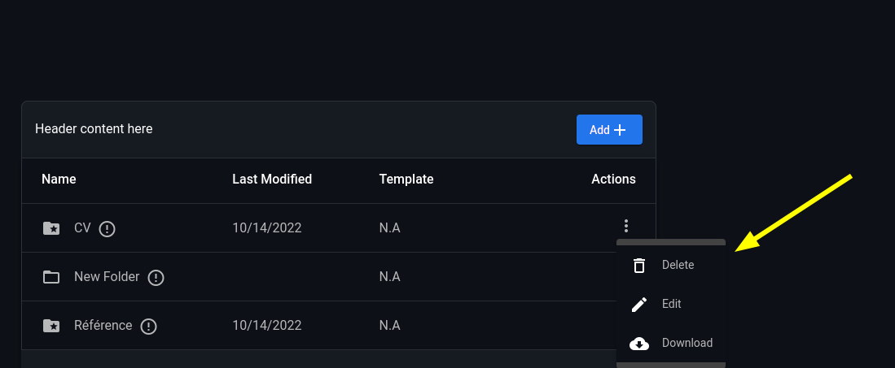

# 🌟 Special Folder

Some folders are considered special. Once a they have been created (or renamed into) they will be flagged automatically and assigned the `folder_special` icon so they stand out from the others.

<figure><figcaption></figcaption></figure>

Special folders are locked. In the sense they cannot be deleted nor renamed once they are flagged.

Such actions will not be applied and will instead trigger a warning.

<figure><figcaption></figcaption></figure>

<figure><figcaption></figcaption></figure>

&#x20;
